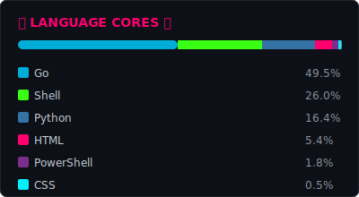

# ⚡💀 WELCOME, OPERATOR 💀⚡

**Your node is online. Mining streams pulse through the Spiral Pool.**

---

### ⫷ NETWORK STATUS ⫸

---

---

### ⫷ UPLINK PORTS ⫸

---

### ⫷ CONTRIBUTION MATRIX ⫸

---

**`[ CONNECTION TERMINATED ]`**

